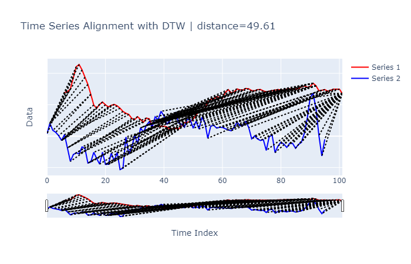
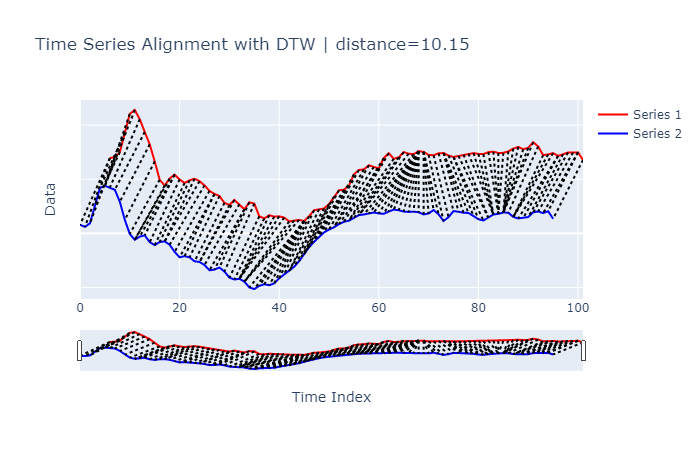
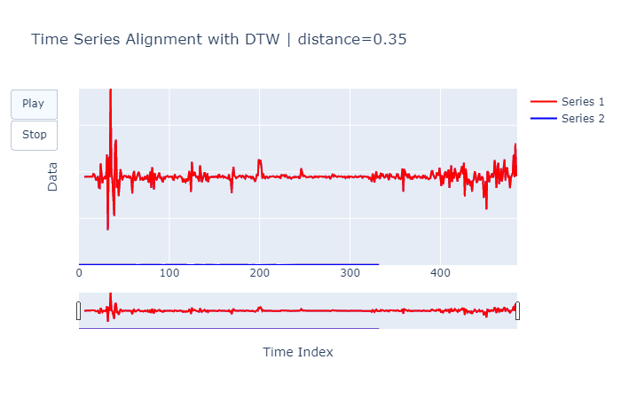

```python
import numpy as np 
import pandas as pd
import time
import warnings
import matplotlib.pyplot as plt
from sklearn.metrics import confusion_matrix, accuracy_score
from dtw import DTW
from one_nn import OneNN
```


```python
train = pd.read_csv('datasets/ECG200/ECG200_TRAIN.tsv', 
                   header=None,
                   sep='\t')

test = pd.read_csv('datasets/ECG200/ECG200_TEST.tsv', 
                   header=None,
                   sep='\t')

print('Training set', train.shape)
print('Testing set', test.shape)
```

    Training set (100, 97)
    Testing set (100, 97)
    


```python
train.head() 
# first column is the label
# each row is time series
```


<div>
<style scoped>
    .dataframe tbody tr th:only-of-type {
        vertical-align: middle;
    }

    .dataframe tbody tr th {
        vertical-align: top;
    }

    .dataframe thead th {
        text-align: right;
    }
</style>
<table border="1" class="dataframe">
  <thead>
    <tr style="text-align: right;">
      <th></th>
      <th>0</th>
      <th>1</th>
      <th>2</th>
      <th>3</th>
      <th>4</th>
      <th>5</th>
      <th>6</th>
      <th>7</th>
      <th>8</th>
      <th>9</th>
      <th>10</th>
      <th>11</th>
      <th>12</th>
      <th>13</th>
      <th>14</th>
      <th>15</th>
      <th>16</th>
      <th>17</th>
      <th>18</th>
      <th>19</th>
      <th>20</th>
      <th>21</th>
      <th>22</th>
      <th>23</th>
      <th>24</th>
      <th>25</th>
      <th>26</th>
      <th>27</th>
      <th>28</th>
      <th>29</th>
      <th>30</th>
      <th>31</th>
      <th>32</th>
      <th>33</th>
      <th>34</th>
      <th>35</th>
      <th>36</th>
      <th>37</th>
      <th>38</th>
      <th>39</th>
      <th>...</th>
      <th>57</th>
      <th>58</th>
      <th>59</th>
      <th>60</th>
      <th>61</th>
      <th>62</th>
      <th>63</th>
      <th>64</th>
      <th>65</th>
      <th>66</th>
      <th>67</th>
      <th>68</th>
      <th>69</th>
      <th>70</th>
      <th>71</th>
      <th>72</th>
      <th>73</th>
      <th>74</th>
      <th>75</th>
      <th>76</th>
      <th>77</th>
      <th>78</th>
      <th>79</th>
      <th>80</th>
      <th>81</th>
      <th>82</th>
      <th>83</th>
      <th>84</th>
      <th>85</th>
      <th>86</th>
      <th>87</th>
      <th>88</th>
      <th>89</th>
      <th>90</th>
      <th>91</th>
      <th>92</th>
      <th>93</th>
      <th>94</th>
      <th>95</th>
      <th>96</th>
    </tr>
  </thead>
  <tbody>
    <tr>
      <th>0</th>
      <td>-1</td>
      <td>0.502055</td>
      <td>0.542163</td>
      <td>0.722383</td>
      <td>1.428885</td>
      <td>2.136516</td>
      <td>2.281149</td>
      <td>1.936274</td>
      <td>1.468890</td>
      <td>1.008845</td>
      <td>0.380282</td>
      <td>-0.296780</td>
      <td>-0.513929</td>
      <td>-0.255645</td>
      <td>-0.107203</td>
      <td>-0.287827</td>
      <td>-0.418009</td>
      <td>-0.319163</td>
      <td>-0.260379</td>
      <td>-0.350357</td>
      <td>-0.505486</td>
      <td>-0.710887</td>
      <td>-0.823920</td>
      <td>-0.899702</td>
      <td>-1.153950</td>
      <td>-1.229831</td>
      <td>-1.044091</td>
      <td>-1.202031</td>
      <td>-1.392195</td>
      <td>-1.130108</td>
      <td>-1.179867</td>
      <td>-1.649272</td>
      <td>-1.726575</td>
      <td>-1.608370</td>
      <td>-1.662802</td>
      <td>-1.650672</td>
      <td>-1.697309</td>
      <td>-1.838697</td>
      <td>-1.802596</td>
      <td>-1.780536</td>
      <td>...</td>
      <td>0.683870</td>
      <td>0.474995</td>
      <td>0.532797</td>
      <td>0.723550</td>
      <td>0.664420</td>
      <td>0.647936</td>
      <td>0.757054</td>
      <td>0.732072</td>
      <td>0.620215</td>
      <td>0.606297</td>
      <td>0.677950</td>
      <td>0.689084</td>
      <td>0.598807</td>
      <td>0.542647</td>
      <td>0.581807</td>
      <td>0.630631</td>
      <td>0.664420</td>
      <td>0.686318</td>
      <td>0.657383</td>
      <td>0.650889</td>
      <td>0.721738</td>
      <td>0.739706</td>
      <td>0.691481</td>
      <td>0.695229</td>
      <td>0.750115</td>
      <td>0.853845</td>
      <td>0.916019</td>
      <td>0.827750</td>
      <td>0.880906</td>
      <td>1.088831</td>
      <td>0.931043</td>
      <td>0.610298</td>
      <td>0.638894</td>
      <td>0.684679</td>
      <td>0.583238</td>
      <td>0.640522</td>
      <td>0.708585</td>
      <td>0.705011</td>
      <td>0.713815</td>
      <td>0.433765</td>
    </tr>
    <tr>
      <th>1</th>
      <td>1</td>
      <td>0.147647</td>
      <td>0.804668</td>
      <td>0.367771</td>
      <td>0.243894</td>
      <td>0.026614</td>
      <td>-0.274402</td>
      <td>0.096731</td>
      <td>-0.747731</td>
      <td>-1.609777</td>
      <td>-1.179593</td>
      <td>-1.055926</td>
      <td>-1.128777</td>
      <td>-0.686039</td>
      <td>-0.798789</td>
      <td>-1.714279</td>
      <td>-1.649858</td>
      <td>-1.032699</td>
      <td>-1.423918</td>
      <td>-1.782433</td>
      <td>-1.025126</td>
      <td>-1.798909</td>
      <td>-1.793614</td>
      <td>-1.085478</td>
      <td>-1.574390</td>
      <td>-1.036059</td>
      <td>-2.130021</td>
      <td>-2.038621</td>
      <td>-0.055013</td>
      <td>-1.140195</td>
      <td>-0.704275</td>
      <td>0.048723</td>
      <td>-0.475854</td>
      <td>0.525865</td>
      <td>0.244778</td>
      <td>0.679932</td>
      <td>0.928601</td>
      <td>0.573041</td>
      <td>1.231607</td>
      <td>1.043324</td>
      <td>...</td>
      <td>0.631120</td>
      <td>0.694075</td>
      <td>0.515071</td>
      <td>0.559229</td>
      <td>0.555712</td>
      <td>0.469694</td>
      <td>0.388821</td>
      <td>0.343129</td>
      <td>0.535598</td>
      <td>0.900708</td>
      <td>0.656846</td>
      <td>0.690033</td>
      <td>0.952596</td>
      <td>0.547770</td>
      <td>-0.167693</td>
      <td>0.011532</td>
      <td>-0.176488</td>
      <td>-0.277706</td>
      <td>-0.224836</td>
      <td>-0.910723</td>
      <td>-0.037932</td>
      <td>0.071668</td>
      <td>-1.048920</td>
      <td>-0.636218</td>
      <td>-0.386637</td>
      <td>-0.507512</td>
      <td>-0.716656</td>
      <td>-0.463758</td>
      <td>-0.460442</td>
      <td>-0.770792</td>
      <td>-0.533503</td>
      <td>-0.400228</td>
      <td>0.176084</td>
      <td>1.111768</td>
      <td>2.438428</td>
      <td>2.734889</td>
      <td>1.736054</td>
      <td>0.036857</td>
      <td>-1.265074</td>
      <td>-0.208024</td>
    </tr>
    <tr>
      <th>2</th>
      <td>-1</td>
      <td>0.316646</td>
      <td>0.243199</td>
      <td>0.370471</td>
      <td>1.063738</td>
      <td>1.678187</td>
      <td>1.759558</td>
      <td>1.697717</td>
      <td>1.612159</td>
      <td>1.168188</td>
      <td>0.499957</td>
      <td>-0.022363</td>
      <td>-0.235318</td>
      <td>-0.118273</td>
      <td>-0.071027</td>
      <td>-0.322986</td>
      <td>-0.433562</td>
      <td>-0.318660</td>
      <td>-0.295655</td>
      <td>-0.417733</td>
      <td>-0.682480</td>
      <td>-0.881840</td>
      <td>-0.843320</td>
      <td>-0.883652</td>
      <td>-1.030018</td>
      <td>-1.055265</td>
      <td>-1.168637</td>
      <td>-1.363991</td>
      <td>-1.337611</td>
      <td>-1.261294</td>
      <td>-1.409782</td>
      <td>-1.634504</td>
      <td>-1.703238</td>
      <td>-1.677025</td>
      <td>-1.782628</td>
      <td>-1.996872</td>
      <td>-2.056372</td>
      <td>-1.937881</td>
      <td>-1.879412</td>
      <td>-1.915427</td>
      <td>...</td>
      <td>0.675666</td>
      <td>0.699885</td>
      <td>0.732561</td>
      <td>0.771665</td>
      <td>0.738129</td>
      <td>0.723699</td>
      <td>0.806876</td>
      <td>0.878984</td>
      <td>0.855791</td>
      <td>0.806384</td>
      <td>0.792501</td>
      <td>0.803814</td>
      <td>0.781938</td>
      <td>0.700439</td>
      <td>0.735960</td>
      <td>0.864162</td>
      <td>0.707670</td>
      <td>0.458756</td>
      <td>0.600146</td>
      <td>0.825136</td>
      <td>0.800034</td>
      <td>0.762821</td>
      <td>0.755443</td>
      <td>0.653766</td>
      <td>0.526441</td>
      <td>0.477339</td>
      <td>0.574946</td>
      <td>0.698425</td>
      <td>0.722414</td>
      <td>0.771598</td>
      <td>0.764229</td>
      <td>0.610621</td>
      <td>0.552900</td>
      <td>0.566786</td>
      <td>0.604002</td>
      <td>0.777068</td>
      <td>0.812345</td>
      <td>0.748848</td>
      <td>0.818042</td>
      <td>0.539347</td>
    </tr>
    <tr>
      <th>3</th>
      <td>-1</td>
      <td>1.168874</td>
      <td>2.075901</td>
      <td>1.760140</td>
      <td>1.606446</td>
      <td>1.949046</td>
      <td>1.302842</td>
      <td>0.459332</td>
      <td>0.516412</td>
      <td>0.852180</td>
      <td>0.989227</td>
      <td>0.821253</td>
      <td>0.576448</td>
      <td>0.743089</td>
      <td>0.852970</td>
      <td>0.307458</td>
      <td>-0.130391</td>
      <td>-0.062200</td>
      <td>-0.100727</td>
      <td>-0.232818</td>
      <td>-0.234465</td>
      <td>-0.214756</td>
      <td>-0.230413</td>
      <td>-0.227551</td>
      <td>-0.231002</td>
      <td>-0.463479</td>
      <td>-0.724215</td>
      <td>-0.787885</td>
      <td>-0.986687</td>
      <td>-1.224672</td>
      <td>-1.288142</td>
      <td>-1.364148</td>
      <td>-1.428221</td>
      <td>-1.501767</td>
      <td>-1.648084</td>
      <td>-1.705836</td>
      <td>-1.686790</td>
      <td>-1.705719</td>
      <td>-1.777683</td>
      <td>-1.869313</td>
      <td>...</td>
      <td>0.405055</td>
      <td>0.464974</td>
      <td>0.434163</td>
      <td>0.486807</td>
      <td>0.439388</td>
      <td>0.369611</td>
      <td>0.413149</td>
      <td>0.397895</td>
      <td>0.318764</td>
      <td>0.263717</td>
      <td>0.288863</td>
      <td>0.358244</td>
      <td>0.326737</td>
      <td>0.229215</td>
      <td>0.204418</td>
      <td>0.244386</td>
      <td>0.262632</td>
      <td>0.243885</td>
      <td>0.227502</td>
      <td>0.245785</td>
      <td>0.232959</td>
      <td>0.164611</td>
      <td>0.171538</td>
      <td>0.166690</td>
      <td>0.099141</td>
      <td>0.146937</td>
      <td>0.133414</td>
      <td>0.125294</td>
      <td>0.202713</td>
      <td>0.186409</td>
      <td>0.419006</td>
      <td>0.723888</td>
      <td>1.323947</td>
      <td>2.136488</td>
      <td>1.746597</td>
      <td>1.470220</td>
      <td>1.893512</td>
      <td>1.256949</td>
      <td>0.800407</td>
      <td>0.731540</td>
    </tr>
    <tr>
      <th>4</th>
      <td>1</td>
      <td>0.648658</td>
      <td>0.752026</td>
      <td>2.636231</td>
      <td>3.455716</td>
      <td>2.118157</td>
      <td>0.520620</td>
      <td>-0.188627</td>
      <td>0.780818</td>
      <td>0.933775</td>
      <td>0.701402</td>
      <td>1.006133</td>
      <td>0.395784</td>
      <td>-0.369703</td>
      <td>-0.738202</td>
      <td>-0.729084</td>
      <td>-0.906940</td>
      <td>-0.870962</td>
      <td>-1.060217</td>
      <td>-1.197958</td>
      <td>-0.981602</td>
      <td>-1.272497</td>
      <td>-1.287380</td>
      <td>-1.276698</td>
      <td>-1.539702</td>
      <td>-1.346610</td>
      <td>-1.535217</td>
      <td>-1.763418</td>
      <td>-1.688821</td>
      <td>-1.809369</td>
      <td>-1.863891</td>
      <td>-1.994453</td>
      <td>-1.889810</td>
      <td>-1.925713</td>
      <td>-1.833629</td>
      <td>-1.661830</td>
      <td>-1.342510</td>
      <td>-1.011317</td>
      <td>-0.672717</td>
      <td>-0.216157</td>
      <td>...</td>
      <td>0.543004</td>
      <td>0.453148</td>
      <td>0.485785</td>
      <td>0.440679</td>
      <td>0.539153</td>
      <td>0.369571</td>
      <td>0.377316</td>
      <td>0.470113</td>
      <td>0.321448</td>
      <td>0.325513</td>
      <td>0.251259</td>
      <td>0.270571</td>
      <td>0.277161</td>
      <td>0.155171</td>
      <td>0.120954</td>
      <td>0.326395</td>
      <td>0.473952</td>
      <td>0.594736</td>
      <td>0.698199</td>
      <td>0.826781</td>
      <td>0.575166</td>
      <td>0.401196</td>
      <td>0.349966</td>
      <td>0.148053</td>
      <td>-0.033206</td>
      <td>-0.114266</td>
      <td>0.120345</td>
      <td>-0.220102</td>
      <td>-0.151226</td>
      <td>-0.077445</td>
      <td>-0.097869</td>
      <td>-0.136787</td>
      <td>-0.340237</td>
      <td>-0.089441</td>
      <td>-0.080297</td>
      <td>-0.192584</td>
      <td>-0.304704</td>
      <td>-0.454556</td>
      <td>0.314590</td>
      <td>0.582190</td>
    </tr>
  </tbody>
</table>
<p>5 rows × 97 columns</p>
</div>


```python
X_train = train.iloc[:, 1:]
y_train = train.iloc[:, 0]
X_test = test.iloc[:, 1:]
y_test = test.iloc[:, 0]
```

### Visualizing with DTW


```python
print('The series have different labels')
DTW(X_train.iloc[0, :], X_train.iloc[1, :]).plot(return_plot=True)
print('The series have the same labels')
DTW(X_train.iloc[0, :], X_train.iloc[2, :]).plot(return_plot=True)
```

    The series have different labels
    


    The series have the same labels
    



### Interactive plot

Press **Play** to see the animation

* hover over the time series to see their values

* use the slider, located below the main plot, to investigate areas of interest.  


```python
DTW(X_train.iloc[0, :], X_train.iloc[2, :]).plot(standard_graph=False, return_plot=True)
```


### DTW from audio (from freesound.org)


```python
warnings.filterwarnings("ignore")
audio1 = 'audio_data/28023__percy-duke__birdsong.mp3'
audio2 = 'audio_data/501589__tim-kahn__yellow-headed-blackbird.wav'
DTW(audio1, audio2, audio_files=True).plot(standard_graph=False,
                                           return_plot=True) 
```



### Time Series Classification with DTW 


```python
model = OneNN()
model.fit(X_train, y_train)
```


```python
start = time.perf_counter()
prediction = model.predict(X_test)
time_taken = time.perf_counter() - start
actual = y_test.values
accuracy = accuracy_score(actual, prediction)
print('Took {0:.2f} sec'.format(time_taken))
print('Confusion matrix')
print(confusion_matrix(actual, prediction))
print('Accuracy {}'.format(accuracy))
```

    Took 145.97 sec
    Confusion matrix
    [[23 13]
     [ 7 57]]
    Accuracy 0.8
    
